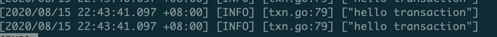

# High Performance TiDB 课程 - Lesson 1


课程链接：https://www.bilibili.com/video/BV17K411T7Kd


## 目标


## 思路


1. 部署一个1+1+3集群

2. 找到TiDB中事务begin相关的源码及log相关代码

   1. 搜索“begin”（事务开始一般都是这样的关键词，如果找不到，就从两阶段提交入手倒退到事务开始的位置）
   2. 在与kv层找到` newTiKVTxn`事务开始的方法

3. 插入"hello transaction"日志

   ```
   logutil.BgLogger().Info("hello transaction")
   ```

4. 重新编译修改后的tidb-server源码，并生成二进制

5. 将修改后的二进制包替换测试集群中的tidb-server，并重启tidb-server

   

## 单机测试集群部署

1. 通过TiUP快速部署一个模拟生产环境的单机测试集群，参考https://docs.pingcap.com/zh/tidb/dev/quick-start-with-tidb
2. 部署完成后，可以tidb-deploy上看到相应的组件目录

```
grafana-3000  monitor-9100  pd-2379  prometheus-9090  tidb-4000  tiflash-9000  tikv-20160  tikv-20161  tikv-20162
```

部署完成后的截图如下：


## 结果


- 截图




- 代码提交位置

https://github.com/sylzd/tidb/commit/c4a9429441bd188a18382e1861bc6f3d45de02e3


