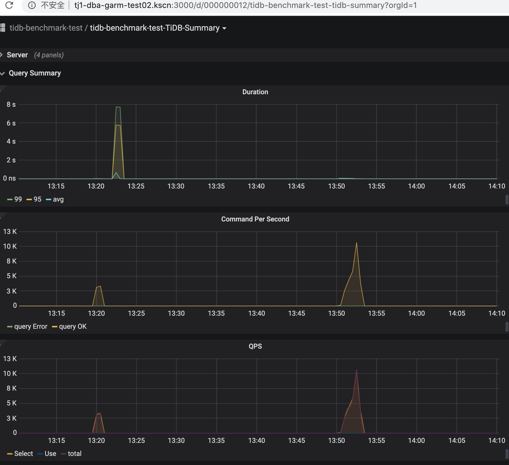

# High Performance TiDB 课程 - Lesson 2


[TOC]


课程链接：https://www.bilibili.com/video/BV1TD4y1m7AF/


## 目标


## 学习

| [1. 使用 TiUP 部署 TiDB 集群](https://docs.pingcap.com/zh/tidb/stable/production-deployment-using-tiup) |
| ------------------------------------------------------------ |
| [2. TiKV 线程池优化](https://github.com/pingcap-incubator/tidb-in-action/blob/master/session4/chapter8/threadpool-optimize.md) |
| [3. PD Dashboard 说明](https://docs.pingcap.com/zh/tidb/stable/dashboard-intro) |
| [4. TPCC 背景知识](https://github.com/pingcap-incubator/tidb-in-action/blob/master/session4/chapter3/tpc-c.md) |
| [5. ycsb,sysbench](https://github.com/pingcap-incubator/tidb-in-action/blob/master/session4/chapter3/sysbench.md) |


## 环境


### 基本环境

| 类别 |                名称                |
| :--: | :--------------------------------: |
|  OS  |   CentOS Linux release 7.3.1611    |
| CPU  | 16  Intel Core Processor (Skylake) |
| RAM  |                32G                 |
| DISK |              200G SSD              |


### NUMA信息

```
node 0 cpus: 0 1 2 3 4 5 6 7 8 9 10 11 12 13 14 15
node 0 size: 32767 MB
node 0 free: 544 MB
node distances:
node   0
  0:  10
```

只有一个numa节点


### 拓扑结构

在一个云主机节点上，实例信息如下：

| TiDB | TIKV | TiKV |
| ---- | ---- | ---- |
| 1    | 3    | 3    |


### 调整后的配置

开始可以使用基本的配置，压测运行后可以通过观察 Grafana 并参考 [TiKV 调优说明]进行调整。如出现单线程模块瓶颈，可以通过扩展 TiKV 节点来进行负载均摊；如出现多线程模块瓶颈，可以通过增加该模块并发度进行调整。除课程建议文章的阅读外，还参考了官方文档的配置章节：https://docs.pingcap.com/zh/tidb/stable/tikv-configuration-file


修改配置语句： 

```bash
tiup cluster edit-config tidb-benchmark-test
```


- tidb.toml

  ```toml
  [log]
  # 减少慢日志的输出
  slow-threshold = 3000
  # 升高日志级别，可以减少打印日志数量，对性能有积极影响。
  level = "error"
  
  [performance]
  # 性能相关配置，可以根据机器的 CPU 核数设置，设置 TiDB 的 CPU 使用数量。
  max-procs = 16
  
  [prepared-plan-cache]
  # 缓存语句数量设置，开启 TiDB 配置中的 prepared plan cache，可减少优化执行计划的开销。
  enabled = true
  
  [tikv-client]
  # 与 TiKV 客户端相关的设置，默认值为 16；当节点负载比较低时，可适当调大该值。
  grpc-connection-count = 8
  
  [txn-local-latches]
  # 本地事务冲突检测设置，并发压测时建议开启，可减少事务的冲突。
  # # Enable local latches for transactions. Enable it when
  # # there are lots of conflicts between transactions.
  enabled = true
  ```

- tikv.toml

  ```toml
  
  [global]
  # 调整日志级别，升高 TiKV 的日志级别同样有利于性能表现。
  log-level = "error"
  
  [server]
  # 本机16核cpu，有3个tikv，另外还有tidb、pd等服务，感觉应该减小为2
  ## Size of the thread pool for the gRPC server.
  grpc-concurrency = 2
  
  [readpool]
  # UnifyReadPool 负责处理所有的读取请求。默认配置（readpool.unified.max-thread-count）大小为机器 CPU 数的 80%。通常建议根据业务负载特性调整其 CPU 使用率在 60%～90% 之间。
  [readpool.coprocessor]
  # 使用统一的读取线程池处理协处理器请求
  use-unified-pool = true
  [readpool.storage]
  # 用统一的读取线程池处理存储请求，这里测试集群只有1个tidb应该无所谓
  use-unified-pool = false
  
  
  
  [raftstore]
  # 关闭 sync-log，由于TiKV 是以集群形式部署，在 Raft 算法的作用下，能保证大多数节点已经写入数据，除了对数据安全极端敏感的场景之外，raftstore 中的 sync-log 选项可以关
  闭。
  sync-log = false
  
  [storage]
  # 由于部署多个kv，优化为2
  ## Scheduler's worker pool size, i.e. the number of write threads.
  ## It should be less than total CPU cores. When there are frequent write operations, set it to a
  ## higher value. More specifically, you can run `top -H -p tikv-pid` to check whether the threads
  ## named `sched-worker-pool` are busy.
  scheduler-worker-pool-size = 2
  
  # 数据导入过程中发现磁盘扛不住，优化写池子为1
  ## Use how many threads to handle raft messages
  store-pool-size = 1
  
  [storage.block-cache]
  # 块缓存配置，在 TiKV 中需要根据机器内存大小(本机为32G内存)配置 RocksDB 的 block cache，以充分利用内存。
  capacity = "8GB"
  ```


## sysbench测试

- 下载安装

  这个之前装过，直接拷贝bin和依赖的lib过来

- 准备数据

  ```bash
  mysql -h127.0.0.1 -P4000
  >create database sbtest;
  # 导入数据之前先设置为乐观事务模式，导入结束后再设置回悲观模式
  >set global tidb_disable_txn_auto_retry = off;
  >set global tidb_txn_mode="optimistic";
  # 导入测试数据
  cd sysbench_bin;export LD_LIBRARY_PATH=./lib; ./sysbench oltp_point_select --tables=10 --threads=10 --table-size=10000000 --mysql-host=127.0.0.1 --mysql-port=4000 --mysql-user=root prepare
  ```

- 运行测试

  ```bash
  # 调回悲观模式
  > set global tidb_txn_mode="pessimistic" ;
  
  #1. point_select测试
  export LD_LIBRARY_PATH=./lib;./sysbench oltp_point_select --tables=10 --threads=10 --table-size=10000000 --mysql-host=127.0.0.1 --mysql-port=4000 --mysql-user=root --time=120  --report-interval=10 run
  ```
  
- 测试结果

  1. point_select测试

     第一次运行时间在`13:19:18`~`13:21:19`

     ```
     [ 10s ] thds: 10 tps: 7186.18 qps: 7186.18 (r/w/o: 7186.18/0.00/0.00) lat (ms,95%): 2.91 err/s: 0.00 reconn
     /s: 0.00
     [ 20s ] thds: 10 tps: 6931.54 qps: 6931.54 (r/w/o: 6931.54/0.00/0.00) lat (ms,95%): 2.76 err/s: 0.00 reconn
     /s: 0.00
     [ 30s ] thds: 10 tps: 1498.00 qps: 1498.00 (r/w/o: 1498.00/0.00/0.00) lat (ms,95%): 4.25 err/s: 0.00 reconn
     /s: 0.00
     [ 41s ] thds: 10 tps: 178.05 qps: 178.05 (r/w/o: 178.05/0.00/0.00) lat (ms,95%): 68.05 err/s: 0.00 reconn/s
     : 0.00
     [ 50s ] thds: 10 tps: 854.67 qps: 854.67 (r/w/o: 854.67/0.00/0.00) lat (ms,95%): 8.13 err/s: 0.00 reconn/s:
      0.00
     [ 70s ] thds: 10 tps: 358.67 qps: 358.67 (r/w/o: 358.67/0.00/0.00) lat (ms,95%): 10.84 err/s: 0.00 reconn/s
     : 0.00
     [ 90s ] thds: 10 tps: 0.00 qps: 0.00 (r/w/o: 0.00/0.00/0.00) lat (ms,95%): 0.00 err/s: 0.00 reconn/s: 0.00
     [ 100s ] thds: 10 tps: 516.41 qps: 516.41 (r/w/o: 516.41/0.00/0.00) lat (ms,95%): 3.96 err/s: 0.00 reconn/s
     : 0.00
     [ 110s ] thds: 10 tps: 0.00 qps: 0.00 (r/w/o: 0.00/0.00/0.00) lat (ms,95%): 0.00 err/s: 0.00 reconn/s: 0.00
     [ 120s ] thds: 10 tps: 0.00 qps: 0.00 (r/w/o: 0.00/0.00/0.00) lat (ms,95%): 0.00 err/s: 0.00 reconn/s: 0.00
     [ 130s ] thds: 10 tps: 0.00 qps: 0.00 (r/w/o: 0.00/0.00/0.00) lat (ms,95%): 0.00 err/s: 0.00 reconn/s: 0.00
     [ 160s ] thds: 10 tps: 0.00 qps: 0.00 (r/w/o: 0.00/0.00/0.00) lat (ms,95%): 0.00 err/s: 0.00 reconn/s: 0.00
     [ 170s ] thds: 10 tps: 1.05 qps: 1.05 (r/w/o: 1.05/0.00/0.00) lat (ms,95%): 71026.01 err/s: 0.00 reconn/s:
     0.00
     SQL statistics:
         queries performed:
             read:                            179503
             write:                           0
             other:                           0
             total:                           179503
         transactions:                        179503 (1051.50 per sec.)
         queries:                             179503 (1051.50 per sec.)
         ignored errors:                      0      (0.00 per sec.)
         reconnects:                          0      (0.00 per sec.)
     
     Throughput:
         events/s (eps):                      1051.4955
         time elapsed:                        170.7121s
         total number of events:              179503
     
     Latency (ms):
              min:                                    0.14
              avg:                                    9.16
              max:                                70944.90
              95th percentile:                        3.30
              sum:                              1644091.20
     
     Threads fairness:
         events (avg/stddev):           17950.3000/185.60
         execution time (avg/stddev):   164.4091/0.54
     ```

  第二次运行时间在`13:50:18` ~`13:52:19`
  
  ```
  Running the test with following options:
  Number of threads: 10
  Report intermediate results every 10 second(s)
  Initializing random number generator from current time
  
  
  Initializing worker threads...
  
  Threads started!
  
  [ 10s ] thds: 10 tps: 3325.66 qps: 3325.66 (r/w/o: 3325.66/0.00/0.00) lat (ms,95%): 7.04 err/s: 0.00 reconn/s: 0.00
  [ 20s ] thds: 10 tps: 3595.14 qps: 3595.14 (r/w/o: 3595.14/0.00/0.00) lat (ms,95%): 6.43 err/s: 0.00 reconn/s: 0.00
  [ 30s ] thds: 10 tps: 4070.94 qps: 4070.94 (r/w/o: 4070.94/0.00/0.00) lat (ms,95%): 6.32 err/s: 0.00 reconn/s: 0.00
  [ 40s ] thds: 10 tps: 5034.22 qps: 5034.22 (r/w/o: 5034.22/0.00/0.00) lat (ms,95%): 4.57 err/s: 0.00 reconn/s: 0.00
  
  
  [ 50s ] thds: 10 tps: 4161.31 qps: 4161.31 (r/w/o: 4161.31/0.00/0.00) lat (ms,95%): 5.09 err/s: 0.00 reconn/s: 0.00
  [ 60s ] thds: 10 tps: 4068.34 qps: 4068.34 (r/w/o: 4068.34/0.00/0.00) lat (ms,95%): 6.21 err/s: 0.00 reconn/s: 0.00
  [ 70s ] thds: 10 tps: 3927.11 qps: 3927.11 (r/w/o: 3927.11/0.00/0.00) lat (ms,95%): 6.43 err/s: 0.00 reconn/s: 0.00
  [ 80s ] thds: 10 tps: 5043.91 qps: 5043.91 (r/w/o: 5043.91/0.00/0.00) lat (ms,95%): 4.18 err/s: 0.00 reconn/s: 0.00
  [ 90s ] thds: 10 tps: 9851.19 qps: 9851.19 (r/w/o: 9851.19/0.00/0.00) lat (ms,95%): 2.39 err/s: 0.00 reconn/s: 0.00
  [ 100s ] thds: 10 tps: 11163.28 qps: 11163.28 (r/w/o: 11163.28/0.00/0.00) lat (ms,95%): 2.14 err/s: 0.00 reconn/s: 0.00
  [ 110s ] thds: 10 tps: 11967.20 qps: 11967.20 (r/w/o: 11967.20/0.00/0.00) lat (ms,95%): 2.07 err/s: 0.00 reconn/s: 0.00
  [ 120s ] thds: 10 tps: 13094.72 qps: 13094.72 (r/w/o: 13094.72/0.00/0.00) lat (ms,95%): 1.96 err/s: 0.00 reconn/s: 0.00
  SQL statistics:
      queries performed:
          read:                            793028
          write:                           0
          other:                           0
          total:                           793028
      transactions:                        793028 (6607.80 per sec.)
      queries:                             793028 (6607.80 per sec.)
      ignored errors:                      0      (0.00 per sec.)
      reconnects:                          0      (0.00 per sec.)
  
  Throughput:
      events/s (eps):                      6607.7954
      time elapsed:                        120.0140s
      total number of events:              793028
  
  Latency (ms):
           min:                                    0.15
           avg:                                    1.51
           max:                                   96.49
           95th percentile:                        2.97
           sum:                              1199006.05
  
  Threads fairness:
      events (avg/stddev):           79302.8000/255.30
      execution time (avg/stddev):   119.9006/0.01
  ```
  
  


- 结果分析

  从监控图中很容易看到IO瓶颈和CPU瓶颈，**但是第二次运行的结果明显比第一次运行要正常**。第一次甚至造成了系统的卡顿与监控的缺失，**说明单机运行非常不稳定，但是这个不稳定的点暂时不知道**

  - TiDB Query Summary 中的 qps 与 duration
  
    
  
  
  
  - TiKV Details 面板中 Cluster 中各 server 的 CPU 以及 QPS 指标
  
  
  
  
  - TiKV Details 面板中 grpc 的 qps 以及 duration
  
    

## go-ycsb测试

- 下载安装

```bash
  git clone https://github.com/pingcap/go-ycsb.git --depth=1
  cd go-ycsb
  make
```

- 准备数据

  ```
  # 准备1kw条数据
  ./bin/go-ycsb load mysql -P workloads/workloada -p recordcount=10000000 -p mysql.host=127.0.0.1 -p mysql.port=4000 --threads 16
  ```

- 运行测试 18:20~18:25

  ```
  ./bin/go-ycsb run mysql -P workloads/workloada -p operationcount=10000000 -p mysql.host=127.0.0.1 -p mysql.port=4000 --threads 16
  ```

  

- 测试结果

  - TiDB Query Summary 中的 qps 与 duration

    

  - TiKV Details 面板中 Cluster 中各 server 的 CPU 以及 QPS 指标

    

  - TiKV Details 面板中 grpc 的 qps 以及 duration

    

## go-tpc测试


- 下载安装

  ```bash
  git clone https://github.com/pingcap/go-tpc.git --depth=1
  cd go-tpc
  make build
  ```

### TPC-C

- 准备数据

  ```bash
  cd go-tpc
  # 2500个仓库大概为160GB左右；5000个仓库大概为280GB左右;三副本会再*3;这里用100发现导入太慢，改为10
  ./bin/go-tpc tpcc -H 127.0.0.1 -P 4000 -D tpcc --warehouses 10 prepare
  ```

- 运行测试 19:09~19:13

  ```bash
  ./bin/go-tpc tpcc -H 127.0.0.1 -P 4000 -D tpcc --warehouses 10 run
  ```

- 测试结果：每分钟成交订单数

  ```
  Current] STOCK_LEVEL - Takes(s): 6.5, Count: 4, TPM: 36.7, Sum(ms): 127, Avg(ms): 31, 90th(ms): 64, 99th(ms): 64, 99.9th(ms): 64
  [Current] DELIVERY - Takes(s): 7.3, Count: 4, TPM: 32.8, Sum(ms): 630, Avg(ms): 157, 90th(ms): 192, 99th(ms): 192, 99.9th(ms): 192
  [Current] NEW_ORDER - Takes(s): 9.7, Count: 84, TPM: 520.6, Sum(ms): 5605, Avg(ms): 66, 90th(ms): 128, 99th(ms): 512, 99.9th(ms): 512
  [Current] ORDER_STATUS - Takes(s): 9.5, Count: 12, TPM: 75.9, Sum(ms): 293, Avg(ms): 24, 90th(ms): 64, 99th(ms): 128, 99.9th(ms): 128
  [Current] PAYMENT - Takes(s): 10.0, Count: 78, TPM: 467.9, Sum(ms): 2941, Avg(ms): 37, 90th(ms): 64, 99th(ms): 256, 99.9th(ms): 256
  [Current] STOCK_LEVEL - Takes(s): 4.4, Count: 5, TPM: 68.0, Sum(ms): 442, Avg(ms): 88, 90th(ms): 160, 99th(ms): 160, 99.9th(ms): 160
  ```

  

  - TiDB Query Summary 中的 qps 与 duration

    

  - TiKV Details 面板中 Cluster 中各 server 的 CPU 以及 QPS 指标

    

  - TiKV Details 面板中 grpc 的 qps 以及 duration

    

  ## 

### TPC-H
针对分析性数据库，数据仓库等应用

- 准备数据

  ```bash
  cd go-tpc
  # sf 10, 大概为10G大小数据(会占用大量内存，不要设太大)
  ./bin/go-tpc tpch prepare -H 127.0.0.1 -P 4000 -D tpch --sf 10 --analyze
  ```

- 运行测试

```bash
./bin/go-tpc tpch run -H 127.0.0.1 -P 4000 -D tpch --sf 10
```

- 测试结果

  - TiDB Query Summary 中的 qps 与 duration

    

  - TiKV Details 面板中 Cluster 中各 server 的 CPU 以及 QPS 指标

    

  - TiKV Details 面板中 grpc 的 qps 以及 duration

    


## 总结与问题


### 总结

学习了**3种能对TiDB进行基准测试的工具使用**，**TiDB一些重要调优参数的理解**。

由于部署在单机上，3个kv轻轻松松把IO打满，CPU也很容易达到100%状态。导致限制TiDB本身的瓶颈不容易真正找出来，后面到真正需要优化的时候，可能还是需要完全模拟内部线上环境，才容易出一份对内部业务有参考价值的测试报告，也更容易找到TiDB本身的瓶颈。另外，如果出完整测试报告的话，跟同样硬件环境的mysql一起出，然后统一基测参数，感觉比较有意义。


### 遇到的问题

怀疑1，2，4是同一个问题，由于多个服务部署在同一台机器上，由于有3个kv，而默认配置都是根据单机单kv这样来配，所以大量消耗IO和CPU(load.1min随便搞一下就到200)，导致其他服务甚至ssh服务都不能正常工作，优化配置后应该会好转。（主要减小了各种文章中提到过的配置的默认值以适应单机多服务的情况）


1. 运行测试或数据导入时整个系统基本hang住

现象：（如上面的输出文字与截图）

- 命令无法输入

- sysbench的qps输出为0

- 监控断图


2. 监控页面偶尔报错，刷新后恢复

   


3. 对DROP语句如何释放空间？

由于磁盘空间问题，在sysbench测完之后进行了`DROP DATABASE sbtest`操作，但是没有看到空间的释放, 也没有看到对应的gRPC动作，可能因为此时我在导入新的数据有关？


4. go-ycsb导入过程中发生了大量INSERT_ERROR，如何排查这些错误？从IO监控上看，不仅把数据挂载的磁盘IO打满了，把根目录挂载的磁盘IO也打满了。这个是`Write Stalls`问题吗？后面研究下。

   


5. 在测试停止时，经常也会有load打高的情况

   我觉得需要关注，这些没有流量时的消耗资源的动作，比如rebalance? 希望能解答下?

