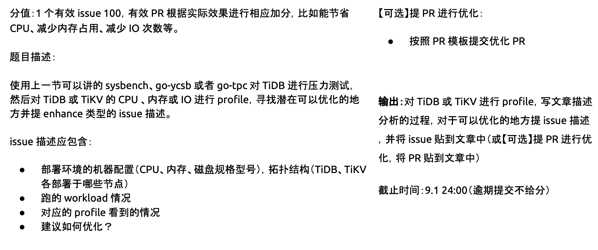
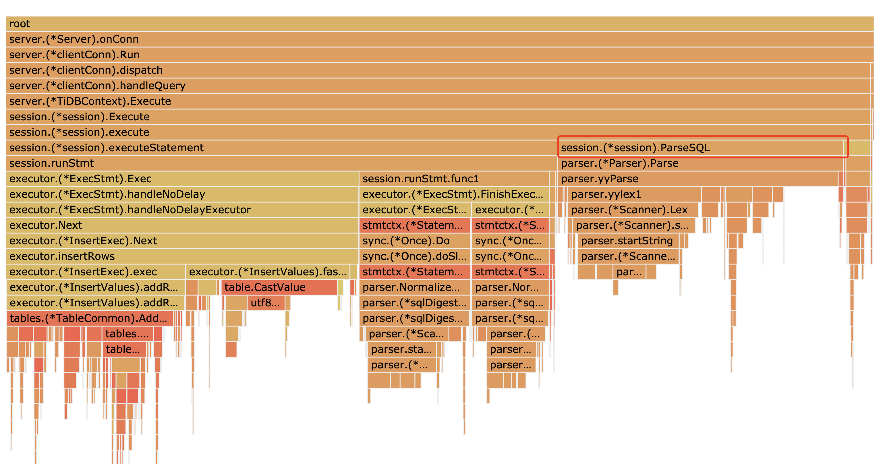
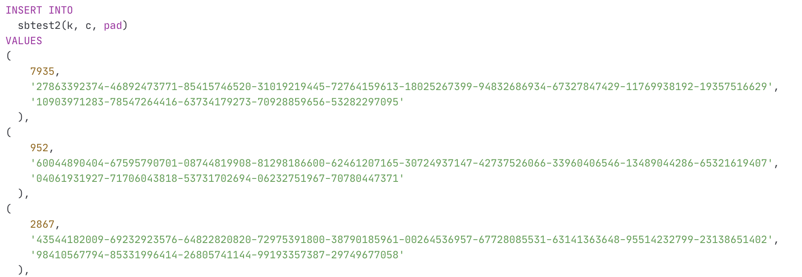

# High Performance TiDB 课程 - Lesson 3


课程链接：https://www.bilibili.com/video/BV1Pp4y1i7zu


## 目标




## Profile学习与实践


- Batch相关参数调参

  - 理论

    **更小的 batch 粒度**
     ○ “batch 划分”消耗的资源相比更多

    - 锁竞争
    - batch 提交的代价

    ○  小事务运行的资源占用更少，整体 资源使用峰值更低

    ○  失败代价更低

    ○  latency 有保障

    **更大的 batch 粒度**

    ○  batch 划分消耗的 资源相比更少

    ○  整体占用 资源多

    ○  失败代价大

    ○  首、尾 batch 不能从流水 线受益

    ○  通常可以带来更好的吞吐，但 latency 相对更高

  - **实践过程**

  

- cpu性能调优
  - 理论

    - CPU usage 高

      - 减少计算开销:更优的算法，减少重复 计算(cache 中间结果)，更优的工程实现

    - CPU load 高

      - 线程太多，频繁切换:跨线程交互是否是必要的?
      - 等 IO，top 看到 iowait 比较高:IO 可能是限制性能的瓶颈

    - Profile原理

      在一段时间内（30s一般ok）进行大量采样，每次采样都能获取到当前某个线程的栈信息，最后进行聚合统计.

    - 性能分析参考：https://docs.pingcap.com/zh/tidb/stable/dashboard-profiling

  - **实践方法**

    - TiDB - pprof调优法

      1. 获取性能分析文件

      ```
      curl http://{TiDBIP}:10080/debug/zip?seconds=60 --output debug.zip
      unzip debug.zip
      # 获得如下文件
      - version tidb-server 版本
      - profile
      CPU profile 文件
      - heap
      heap profile 文件
      - goroutine
      所有 goroutine 的栈信息
      - mutex
      mutex profile 文件
      - config
      tidb server 的配置文件
      ```

      2. 查看cpu-profile文件的graph

         注意点：

          	1. 函数节点位移，箭头调用；
          	2. 图大则子函数开销大；
          	3. 两个时间：本身时间、包含子函数时间；
          	4. 本身时间长则面积大、包含子函数时间长则颜色深

      ```
      go tool pprof -http=:8080 debug/profile
      ```

    - TiKV - perf调优法

      ```bash
      git clone https://github.com/pingcap/tidb-inspect-tools
      cd tracing_tools/perf
      sudo sh ./cpu_tikv.sh $tikv-pid
      sudo sh ./dot_tikv.sh $tikv-pid
      ```

  - **实践过程及结果**(ISSUE1)

    

- io性能调优

  - 理论
    - await: 平均每次设备IO操作的等待时间（毫秒）
    - r_await/w_wait: 读/写操作等待时间
      - 如果该值比较高（比如超过5ms级别）说明磁盘读/写压力比较大

  - 实践方法

    - 从盘的角度看IO - iostat法

      主要关注：iops、io带宽使用以及iowait

      Device: rrqm/s wrqm/s **r/s w/s rMB/s wMB/s** avgrq-sz avgqu-sz **await r_await w_await** svctm %uti

    ```
    iostat -x 1 -m
    ```

    - 从进程角度看IO - iotop

    ```
    iotop -o
    ```

    - 磁盘延迟抖动 - iosnoop

    ```bash
    iosnoop -ts > out
    ```

    - fsync查看 - fio或pg_test_fsync (fsync=n，代表n次write之后调用一次fsync)

    ```
    
    ```

  - **实践过程及结果（TODO）**


- 内存调优

  - 理论（试逻辑而定）

  - 实践方法

    - TiDB  - pprof方法

      ```
      # in-use内存查看
      go tool pprof -http=:8080 debug/heap
      # 历史分配空间查看(包括已释放的)
      go tool pprof -alloc-_space -http=:8080 debug/heap
      # mutex竞争情况查看
      go tool pprof -contentions -http=:8080 debug/mutex
      ```

    - TiKV - perf命令法

      ```bash
      git clone --depth=1 https://github.com/pingcap/tidb-inspect-tools/tree/master/tracing_tools/perf
      cd tracing_tools/perf
      # 插入动态探针
      sudo perf probe -x {tikv-binary} -a malloc
      # 替换mem.sh第一句话为perf record -e probe_tikv:malloc -F 99 -p $1 -g -- sleep 10 
      vi mem.sh
      # 执行mem.sh
      sudo sh mem.sh $tikv-pid
      ```

    - TiKV - bcc工具法

      http://www.brendangregg.com/FlameGraphs/memoryflamegraphs.html

      ```bash
      sudo /usr/share/bcc/tools/stackcount -p $tikv-pid -U $tikv-binary-path:malloc > out.stacks
      ./stackcollapse.pl < out.stacks | ./flamegraph.pl --color=mem --title="malloc() Flame Graph" --countname="calls" > out.svg
      ```

    - Tikv - jemelloc统计法

      ```bash
      tiup ctl tikv --host=$tikv-ip:$tikv-status-port metrics --tag=jemalloc
      tiup ctl:nightly tikv --host=$tikv-ip:$tikv-status-port metrics --tag=jemalloc
      ```

  - **实践过程及结果**

    

    


- 高级工具VTune(可选，略)


## ISSUE - 1描述


- 环境配置

  | 机器编号 | 组件    | CPU                                              | 内存 | 磁盘       |
  | -------- | ------- | ------------------------------------------------ | ---- | ---------- |
  | 68.1     | tidb/pd | 24核 / Intel(R) Xeon(R) CPU E5-2620 v3 @ 2.40GHz | 128G | HDD / 500G |
  | 68.2     | tidb/pd | 24核 / Intel(R) Xeon(R) CPU E5-2620 v3 @ 2.40GHz | 128G | HDD / 500G |
  | 68.41    | tidb/pd | 24核 / Intel(R) Xeon(R) CPU E5-2620 v3 @ 2.40GHz | 128G | HDD / 500G |
  | 69.1     | tikv    | 24核 / Intel(R) Xeon(R) CPU E5-2620 v3 @ 2.40GHz | 128G | HDD / 500G |
  | 69.2     | tikv    | 24核 / Intel(R) Xeon(R) CPU E5-2620 v3 @ 2.40GHz | 128G | HDD / 500G |
  | 68.42    | tikv    | 24核 / Intel(R) Xeon(R) CPU E5-2620 v3 @ 2.40GHz | 128G | HDD / 500G |

- 实验过程

  - 实验

    在sysbench导入阶段进行cpu采样

    ```
    export LD_LIBRARY_PATH=./lib; ./sysbench oltp_point_select --tables=32 --threads=15 --table-size=1000000 --mysql-host=127.0.0.1 --mysql-port=4000 --mysql-user=root prepare
    ```

  - 火焰图

    

  - 性能分析过程

    1. 从火焰图中看到简单的insert操作，但是parser却占了约1/3的cpu时间，感觉不是很合理。从直觉上来说，对于同一类insert的简单语句，parse部分开销应该忽略不计

       ```
       show variables like 'tidb_slow_query_file';
       ```

       

    2. 查看sysbench的prepare执行的sql语句

       看起来只是普通的batch_insert语句，也就是说

       

    3. 提出猜想

        parse会不会因为insert后面的values较多而消耗资源较多？

    4. 求证阶段

       找到一条陈年issue，证明了自己的猜想https://github.com/pingcap/tidb/issues/6431

    5. 优化建议

       对于bulk_insert应当有专门的优化手段（在优化器层实现？），避免频繁做parser的开销，导致load数据很慢。

## 总结

学习并使用了几种tidb的调优手段，并付诸实施，提出猜想，并试验及提出了潜在优化的手段（有空研究下优化器的实现），由于时间有限，没有对mem,io等进行测试，后面有空了补上。